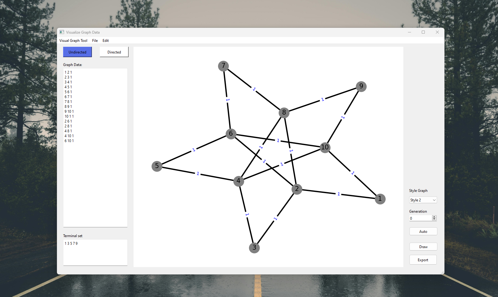
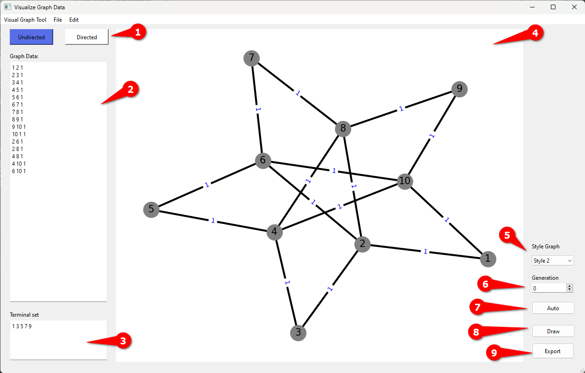

### VISUALIZE GRAPH TOOL

**Visualize Graph Tool for Genetic Algorithms (GA)**

The Visualize Graph Tool is a software application designed to visualize graph data and evolutionary processes within Genetic Algorithms (GA). With its intuitive interface, users can input graph data representing nodes, edges, and their connections. The tool supports both directed and undirected graphs, allowing users to explore different types of network structures.

One of the key features of the tool is its ability to dynamically visualize the evolution of graphs across generations in a GA. Users can specify the number of generations and observe how the graph structure changes over time as the GA algorithm iterates. Additionally, users have the option to choose from various graph styles to customize the visual representation according to their preferences.

#### Tool Demo



#### Features



1. Select types of graph

- Directed Graph.
- Undirected Graph.

2. Graph edges
3. Terminal vertices
4. Graph Display
5. Choose graph styles.
6. Select generations.
7. Auto create generations.
8. Draw graph.
9. Export graph

#### Installation

**1. Create Virtual Env**

```bash
python -m venv venv
```

**2. Install packages**

```bash
pip install -r requirements.txt 
```

**3. Load UI to Py File [Optional]**

**Convert .ui file to .py file**

```bash
pyuic6 -x graph-tool.ui -o .\graph-tool.py
```

**Create iga.exe file**

```bash
g++ .\GA_src\IGA.cpp -o iga.exe
```

**Run application**

```bash
.\run.bat
```
